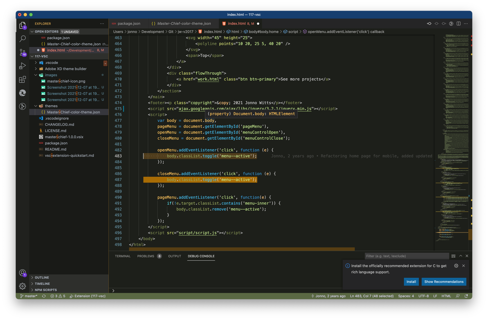
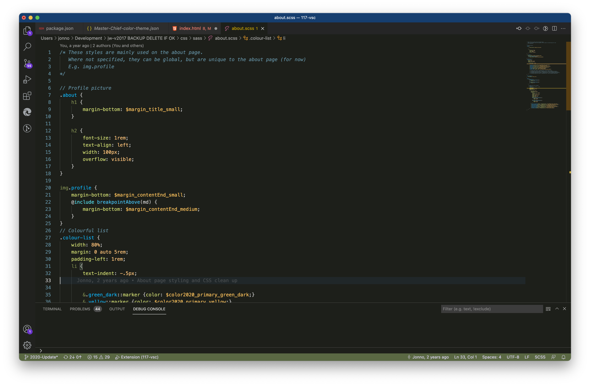
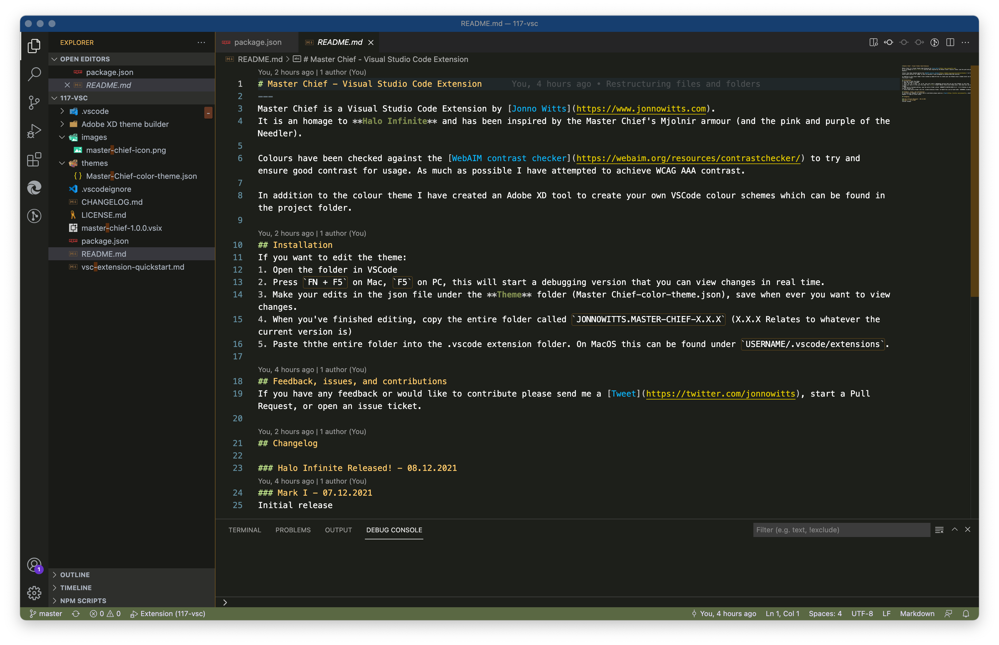
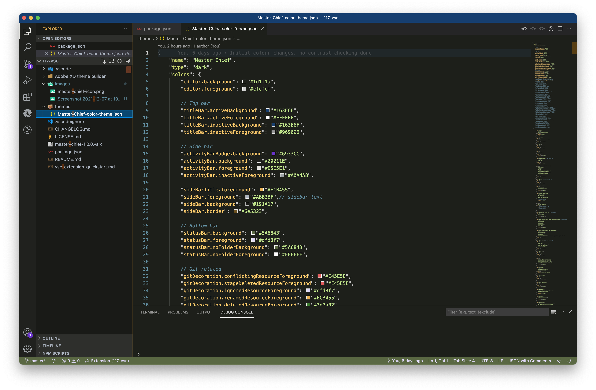
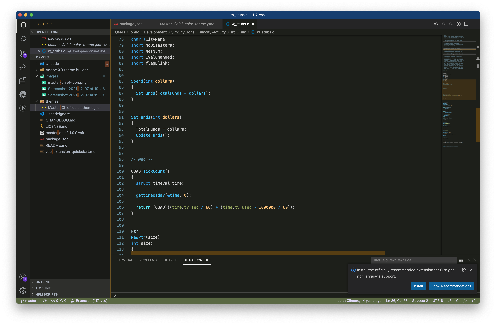

# Master Chief - Visual Studio Code Extension
Master Chief is a Visual Studio Code Extension by [Jonno Witts](https://www.jonnowitts.com).
It is an homage to **Halo Infinite** and has been inspired by the Master Chief's Mjolnir armour (and the pink and purple of the Needler).

## Dark theme
### HTML

### CSS

### Markdown

### JSON

### C

---
Colours have been checked against the [WebAIM contrast checker](https://webaim.org/resources/contrastchecker/) to try and ensure good contrast for usage. As much as possible I have attempted to achieve WCAG AAA contrast.

In addition to the colour theme I have created an Adobe XD tool to create your own VSCode colour schemes which can be found in the project folder.

## Feedback, issues, and contributions
If you have any feedback or would like to contribute please send me a [Tweet](https://twitter.com/jonnowitts), start a Pull Request, or open an issue ticket.

## Changelog

### Halo Infinite Released! - 08.12.2021
### Mark I - 07.12.2021
Initial release

## Installation for editing
If you want to edit the theme:
1. Open the folder in VSCode
2. Press `FN + F5` on Mac, `F5` on PC, this will start a debugging version that you can view changes in real time.
3. Make your edits in the json file under the **Theme** folder (Master Chief-color-theme.json), save when ever you want to view changes.
4. When you've finished editing, copy the entire folder called `JONNOWITTS.MASTER-CHIEF-X.X.X` (X.X.X Relates to whatever the current version is)
5. Paste ththe entire folder into the .vscode extension folder. On MacOS this can be found under `USERNAME/.vscode/extensions`.
